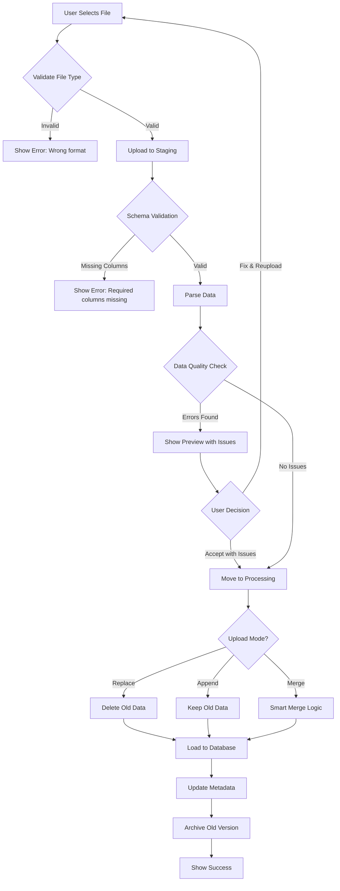

# File Upload Management System - Technical Specification

## 1. Overview

This document specifies a template-based file upload system for an ad-hoc supply chain analytics tool. The system allows users to upload, validate, and manage data files (Sales, Inventory, Suppliers, Purchase Orders) with automatic schema validation, versioning, and database refresh capabilities.

### Core Concept
Users upload files into **predefined slots** with specific schema requirements. The system validates data quality, manages versions, and provides controlled database refresh operations.

### Technology Stack
- **Frontend**: Streamlit (Python) - Provides reactive, data-centric user interface
- **Backend**: FastAPI (Python) - RESTful API for file processing and validation
- **Databases**: 
  - **DuckDB** - Analytical database for file metadata and transactional data
  - **FalkorDB** - Graph database for relational analysis and supply chain networks

**Note:** Section 17 contains comprehensive Streamlit frontend implementation with complete code examples.

---

## 2. System Architecture

### 2.1 File Templates (Predefined Slots)

Define 4 core file categories with required schemas:

| File Category | Required Columns | Optional Columns | File Formats |
|--------------|------------------|------------------|--------------|
| **Sales Data** | `date`, `sku`, `quantity`, `revenue` | `customer_name`, `region`, `category` | `.xlsx`, `.csv` |
| **Inventory Data** | `sku`, `qty_on_hand`, `reorder_point` | `location`, `unit_cost`, `supplier_id` | `.xlsx`, `.csv` |
| **Supplier Data** | `supplier_id`, `supplier_name`, `lead_time` | `contact_email`, `rating`, `country` | `.xlsx`, `.csv` |
| **Purchase Orders** | `po_number`, `sku`, `quantity` | `order_date`, `delivery_date`, `supplier_id` | `.xlsx`, `.csv` |

### 2.2 Data Storage Structure

```
/storage
  /uploads
    /staging          # Temporary upload location
    /active           # Currently active files
    /archive          # Historical versions
  /templates          # Downloadable templates
  /rejected           # Failed validation files
  /error_reports      # Data quality reports
```

### 2.3 Database Tables (DuckDB)

```sql
-- File metadata tracking
CREATE TABLE file_uploads (
    id INTEGER PRIMARY KEY,
    file_category VARCHAR(50),  -- 'sales', 'inventory', 'supplier', 'purchase_order'
    filename VARCHAR(255),
    upload_timestamp TIMESTAMP,
    uploaded_by VARCHAR(100),
    row_count INTEGER,
    file_size_bytes BIGINT,
    status VARCHAR(20),  -- 'active', 'archived', 'rejected'
    quality_score DECIMAL(5,2),
    validation_errors JSON,
    storage_path VARCHAR(500)
);

-- Version history
CREATE TABLE file_versions (
    id INTEGER PRIMARY KEY,
    file_upload_id INTEGER,
    version_number INTEGER,
    replaced_at TIMESTAMP,
    replaced_by INTEGER,
    FOREIGN KEY (file_upload_id) REFERENCES file_uploads(id)
);

-- Data quality issues log
CREATE TABLE data_quality_issues (
    id INTEGER PRIMARY KEY,
    file_upload_id INTEGER,
    issue_type VARCHAR(50),  -- 'duplicate', 'future_date', 'negative_value', 'missing_required'
    severity VARCHAR(20),  -- 'warning', 'error'
    row_numbers JSON,  -- JSON array of affected rows
    issue_count INTEGER,
    auto_resolved BOOLEAN,
    FOREIGN KEY (file_upload_id) REFERENCES file_uploads(id)
);
```

**Note:** DuckDB supports JSON natively for storing validation errors and row numbers. For graph-based analysis of file relationships and dependencies, data is synced to FalkorDB.

---

## 3. File Upload Flow

### 3.1 User Interface Components

#### A. Dashboard View
```
┌─────────────────────────────────────────────────────────────┐
│ 📊 DATA FILES STATUS                                        │
├─────────────────────────────────────────────────────────────┤
│                                                             │
│ [📁 Sales Data]                                             │
│    Status: ✅ Uploaded                                      │
│    Last updated: 2025-02-20 09:15 AM by John               │
│    Rows: 1,247,500 | Quality: 98.5%                        │
│    [Upload New] [Replace] [Preview] [History]              │
│                                                             │
│ [📁 Inventory Data]                                         │
│    Status: ⚠️ Missing                                       │
│    Last updated: Never                                      │
│    [Upload] [Download Template]                            │
│                                                             │
│ [📁 Supplier Data]                                          │
│    Status: ✅ Uploaded                                      │
│    Last updated: 2025-02-18 03:30 PM by Sarah              │
│    Rows: 245 | Quality: 100%                               │
│    [Upload New] [Replace] [Preview] [History]              │
│                                                             │
│ [📁 Purchase Orders]                                        │
│    Status: ⚠️ Outdated (15 days old)                       │
│    Last updated: 2025-02-05 11:00 AM by John               │
│    Rows: 3,420 | Quality: 95.2%                            │
│    [Upload New] [Replace] [Preview] [History]              │
│                                                             │
├─────────────────────────────────────────────────────────────┤
│ Database Status: ⚠️ 1 file pending refresh                 │
│ [🔄 Refresh Database Now] [Bulk Upload] [Settings]         │
└─────────────────────────────────────────────────────────────┘
```

#### B. Upload Modal
```javascript
// Modal structure
{
  title: "Upload Sales Data",
  sections: {
    fileInfo: {
      expectedColumns: ["date", "sku", "quantity", "revenue"],
      optionalColumns: ["customer_name", "region"],
      acceptedFormats: [".xlsx", ".csv"],
      maxFileSize: "100MB"
    },
    currentStatus: {
      lastUpload: "2025-02-15 09:00 AM",
      rowCount: 1200000,
      uploadedBy: "John"
    },
    actions: [
      "Choose File",
      "Download Template",
      "View Validation Rules"
    ]
  }
}
```

### 3.2 Upload Process Flow



### 3.3 Backend API Endpoints

```python
# File Upload API

POST /api/files/upload
Request:
{
  "file_category": "sales",  # sales|inventory|supplier|purchase_order
  "file": <multipart file>,
  "upload_mode": "replace",  # replace|append|merge
  "user_id": "john@company.com"
}

Response:
{
  "status": "success",
  "upload_id": 12345,
  "validation_result": {
    "schema_valid": true,
    "rows_parsed": 125000,
    "rows_valid": 124940,
    "rows_rejected": 60,
    "quality_score": 99.95,
    "issues": [
      {
        "type": "duplicate_rows",
        "severity": "warning",
        "count": 45,
        "auto_resolved": true
      },
      {
        "type": "future_dates",
        "severity": "warning",
        "count": 12,
        "affected_rows": [101, 205, 389, ...]
      }
    ]
  },
  "preview_data": {
    "date_range": "2025-01-01 to 2025-02-15",
    "unique_skus": 1250,
    "total_revenue": 5432100.50
  }
}

# Validation Endpoint
POST /api/files/validate
Request:
{
  "file_category": "sales",
  "file": <multipart file>
}

Response:
{
  "valid": true,
  "required_columns_present": ["date", "sku", "quantity", "revenue"],
  "missing_columns": [],
  "extra_columns": ["customer_name"],
  "sample_rows": [...],
  "estimated_row_count": 125000
}

# Database Refresh
POST /api/database/refresh
Request:
{
  "mode": "full",  # full|incremental
  "file_categories": ["sales", "inventory"]  # optional filter
}

Response:
{
  "status": "processing",
  "job_id": "refresh_67890",
  "estimated_duration_seconds": 45
}

# Get Upload History
GET /api/files/history/{file_category}
Response:
{
  "category": "sales",
  "current": {
    "id": 100,
    "filename": "sales_2025-02-20.xlsx",
    "upload_timestamp": "2025-02-20T09:15:00Z",
    "row_count": 1247500,
    "quality_score": 98.5
  },
  "versions": [
    {
      "id": 95,
      "filename": "sales_2025-02-15.xlsx",
      "upload_timestamp": "2025-02-15T09:00:00Z",
      "row_count": 1200000,
      "status": "archived"
    }
  ]
}

# Restore Previous Version
POST /api/files/restore
Request:
{
  "file_upload_id": 95,
  "file_category": "sales"
}

Response:
{
  "status": "success",
  "restored_version": 95,
  "previous_active": 100
}
```

---

## 4. Validation Rules

### 4.1 Schema Validation

```python
# Python implementation example

SCHEMA_RULES = {
    'sales': {
        'required_columns': ['date', 'sku', 'quantity', 'revenue'],
        'optional_columns': ['customer_name', 'region', 'category'],
        'data_types': {
            'date': 'datetime',
            'sku': 'string',
            'quantity': 'float',
            'revenue': 'float'
        },
        'constraints': {
            'date': {'min': '2020-01-01', 'max': 'today'},
            'quantity': {'min': 0},
            'revenue': {'min': 0}
        }
    },
    'inventory': {
        'required_columns': ['sku', 'qty_on_hand', 'reorder_point'],
        'optional_columns': ['location', 'unit_cost', 'supplier_id'],
        'data_types': {
            'sku': 'string',
            'qty_on_hand': 'integer',
            'reorder_point': 'integer'
        },
        'constraints': {
            'qty_on_hand': {'min': 0},
            'reorder_point': {'min': 0}
        }
    }
}

def validate_file(df, file_category):
    """
    Validate uploaded dataframe against schema rules
    
    Returns:
    {
        'valid': bool,
        'missing_columns': list,
        'type_errors': list,
        'constraint_violations': list,
        'quality_score': float
    }
    """
    rules = SCHEMA_RULES[file_category]
    errors = []
    
    # Check required columns
    missing = set(rules['required_columns']) - set(df.columns)
    if missing:
        errors.append({
            'type': 'missing_columns',
            'columns': list(missing)
        })
    
    # Validate data types
    for col, expected_type in rules['data_types'].items():
        if col in df.columns:
            # Type conversion and validation logic
            pass
    
    # Check constraints
    for col, constraints in rules.get('constraints', {}).items():
        if col in df.columns:
            # Constraint validation logic
            pass
    
    quality_score = calculate_quality_score(errors, len(df))
    
    return {
        'valid': len(errors) == 0,
        'errors': errors,
        'quality_score': quality_score
    }
```

### 4.2 Data Quality Checks

```python
QUALITY_CHECKS = {
    'duplicate_detection': {
        'check': 'Identify duplicate rows',
        'action': 'auto_deduplicate',
        'severity': 'warning'
    },
    'future_dates': {
        'check': 'Dates > current date',
        'action': 'flag_for_review',
        'severity': 'warning'
    },
    'negative_values': {
        'check': 'revenue < 0 or quantity < 0',
        'action': 'exclude_from_analysis',
        'severity': 'error'
    },
    'null_required_fields': {
        'check': 'NULL in required columns',
        'action': 'reject_row',
        'severity': 'error'
    },
    'invalid_sku_format': {
        'check': 'SKU doesn\'t match pattern',
        'action': 'flag_for_review',
        'severity': 'warning'
    }
}

def run_quality_checks(df, file_category):
    """
    Run all quality checks on uploaded data
    
    Returns list of issues with auto-resolution actions
    """
    issues = []
    
    # Duplicate detection
    duplicates = df[df.duplicated()]
    if len(duplicates) > 0:
        df_clean = df.drop_duplicates()
        issues.append({
            'type': 'duplicate_rows',
            'count': len(duplicates),
            'auto_resolved': True,
            'action': f'Removed {len(duplicates)} duplicate rows'
        })
    
    # Future dates check (for sales data)
    if file_category == 'sales' and 'date' in df.columns:
        future_dates = df[df['date'] > pd.Timestamp.now()]
        if len(future_dates) > 0:
            issues.append({
                'type': 'future_dates',
                'count': len(future_dates),
                'affected_rows': future_dates.index.tolist(),
                'auto_resolved': False,
                'action': 'Flagged for review'
            })
    
    # Negative values
    if 'revenue' in df.columns:
        negative_revenue = df[df['revenue'] < 0]
        if len(negative_revenue) > 0:
            df_clean = df[df['revenue'] >= 0]
            issues.append({
                'type': 'negative_revenue',
                'count': len(negative_revenue),
                'auto_resolved': True,
                'action': f'Excluded {len(negative_revenue)} rows from analysis'
            })
    
    return df_clean, issues
```

---

## 5. Upload Modes

### 5.1 Replace Mode (Default)

**Use Case**: Monthly data refreshes, complete data replacement

```python
def replace_mode(new_file, file_category):
    """
    Replace all existing data with new file
    """
    # 1. Validate new file
    df_new = load_and_validate(new_file, file_category)
    
    # 2. Archive current active version
    current = get_active_file(file_category)
    if current:
        archive_file(current)
    
    # 3. Delete old data from database
    delete_from_database(file_category)
    
    # 4. Load new data
    load_to_database(df_new, file_category)
    
    # 5. Update metadata
    update_file_metadata(new_file, file_category, status='active')
    
    return {
        'mode': 'replace',
        'old_row_count': current.row_count if current else 0,
        'new_row_count': len(df_new),
        'status': 'success'
    }
```

### 5.2 Append Mode

**Use Case**: Daily/weekly incremental updates, historical data preservation

```python
def append_mode(new_file, file_category):
    """
    Add new data to existing data
    """
    # 1. Validate new file
    df_new = load_and_validate(new_file, file_category)
    
    # 2. Get existing data count
    existing_count = get_row_count(file_category)
    
    # 3. Append to database
    append_to_database(df_new, file_category)
    
    # 4. Update metadata
    update_file_metadata(new_file, file_category, 
                        status='active', 
                        mode='append')
    
    return {
        'mode': 'append',
        'existing_row_count': existing_count,
        'new_rows_added': len(df_new),
        'total_row_count': existing_count + len(df_new),
        'status': 'success'
    }
```

### 5.3 Smart Merge Mode

**Use Case**: Updates to existing records, late-arriving corrections

```python
def smart_merge_mode(new_file, file_category, merge_key='transaction_id'):
    """
    Intelligently merge new data with existing data
    - UPDATE existing records
    - INSERT new records
    """
    # 1. Validate new file
    df_new = load_and_validate(new_file, file_category)
    
    # 2. Load existing data
    df_existing = load_from_database(file_category)
    
    # 3. Identify overlapping keys
    new_keys = set(df_new[merge_key])
    existing_keys = set(df_existing[merge_key])
    
    update_keys = new_keys & existing_keys  # Intersection
    insert_keys = new_keys - existing_keys  # New only
    
    # 4. Perform merge
    rows_updated = update_database(df_new[df_new[merge_key].isin(update_keys)], 
                                   file_category, 
                                   merge_key)
    rows_inserted = insert_database(df_new[df_new[merge_key].isin(insert_keys)], 
                                    file_category)
    
    # 5. Update metadata
    update_file_metadata(new_file, file_category, 
                        status='active', 
                        mode='merge')
    
    return {
        'mode': 'smart_merge',
        'rows_updated': len(update_keys),
        'rows_inserted': len(insert_keys),
        'total_row_count': len(df_existing) + len(insert_keys),
        'status': 'success'
    }
```

---

## 6. File Versioning

### 6.1 Version Management

```python
VERSION_CONFIG = {
    'max_versions_per_category': 5,  # Keep last 5 versions
    'auto_cleanup': True,
    'retention_days': 30  # Delete versions older than 30 days
}

def archive_version(file_upload_id):
    """
    Archive current active version before new upload
    """
    # 1. Get current active file
    current = db.query(FileUpload).filter(
        FileUpload.id == file_upload_id,
        FileUpload.status == 'active'
    ).first()
    
    # 2. Create version record
    version = FileVersion(
        file_upload_id=current.id,
        version_number=get_next_version_number(current.file_category),
        replaced_at=datetime.now()
    )
    db.add(version)
    
    # 3. Update status to archived
    current.status = 'archived'
    
    # 4. Move file to archive folder
    move_file(current.storage_path, '/storage/archive/')
    
    # 5. Cleanup old versions
    cleanup_old_versions(current.file_category)
    
    db.commit()

def cleanup_old_versions(file_category):
    """
    Delete versions beyond retention limit
    """
    versions = db.query(FileUpload).filter(
        FileUpload.file_category == file_category,
        FileUpload.status == 'archived'
    ).order_by(FileUpload.upload_timestamp.desc()).all()
    
    # Keep only max_versions
    if len(versions) > VERSION_CONFIG['max_versions_per_category']:
        to_delete = versions[VERSION_CONFIG['max_versions_per_category']:]
        for version in to_delete:
            delete_file(version.storage_path)
            db.delete(version)
    
    db.commit()

def restore_version(version_id, file_category):
    """
    Restore a previous version as active
    """
    # 1. Get version to restore
    restore_file = db.query(FileUpload).filter(
        FileUpload.id == version_id
    ).first()
    
    # 2. Archive current active version
    current_active = db.query(FileUpload).filter(
        FileUpload.file_category == file_category,
        FileUpload.status == 'active'
    ).first()
    
    if current_active:
        archive_version(current_active.id)
    
    # 3. Restore from archive
    restore_file.status = 'active'
    move_file(restore_file.storage_path, '/storage/active/')
    
    # 4. Reload to database
    df = load_file(restore_file.storage_path)
    delete_from_database(file_category)
    load_to_database(df, file_category)
    
    db.commit()
```

---

## 7. Database Refresh Operations

### 7.1 Refresh Strategies

```python
class DatabaseRefreshStrategy:
    """
    Three refresh strategies: Manual, Auto, Scheduled
    """
    
    @staticmethod
    def manual_refresh(file_categories=None):
        """
        User-triggered refresh
        Requires explicit confirmation
        """
        # 1. Get pending uploads
        pending = get_pending_uploads(file_categories)
        
        if len(pending) == 0:
            return {'status': 'no_changes', 'message': 'No files pending refresh'}
        
        # 2. Show confirmation to user
        confirmation = {
            'pending_files': pending,
            'warning': 'This will reload data. Current analysis will reset.',
            'action_required': True
        }
        
        # 3. After user confirms, execute refresh
        for file_cat in pending:
            reload_category_data(file_cat)
        
        # 4. Update refresh metadata
        update_refresh_log('manual', file_categories)
        
        return {
            'status': 'success',
            'files_refreshed': pending,
            'timestamp': datetime.now()
        }
    
    @staticmethod
    def auto_refresh(file_category):
        """
        Immediate refresh after file upload
        No user confirmation needed
        """
        # 1. Validate file is ready
        file = get_latest_upload(file_category)
        
        if not file.validation_passed:
            return {'status': 'failed', 'reason': 'Validation not passed'}
        
        # 2. Reload data immediately
        reload_category_data(file_category)
        
        # 3. Update status
        file.status = 'loaded'
        db.commit()
        
        return {
            'status': 'success',
            'file_category': file_category,
            'rows_loaded': file.row_count
        }
    
    @staticmethod
    def scheduled_refresh(schedule_config):
        """
        Cron-based scheduled refresh
        Runs at configured times
        """
        # Schedule example: '0 8 * * *' (8 AM daily)
        
        # 1. Get all pending uploads since last refresh
        last_refresh = get_last_refresh_timestamp()
        pending = get_uploads_after(last_refresh)
        
        if len(pending) == 0:
            return {'status': 'no_changes'}
        
        # 2. Batch refresh all pending
        for file_cat in set([p.file_category for p in pending]):
            reload_category_data(file_cat)
        
        # 3. Log scheduled refresh
        update_refresh_log('scheduled', list(set([p.file_category for p in pending])))
        
        return {
            'status': 'success',
            'files_refreshed': len(pending),
            'next_scheduled': schedule_config['next_run']
        }
```

### 7.2 Progress Tracking

```python
class RefreshProgressTracker:
    """
    Track progress of database refresh operations
    """
    
    def __init__(self, job_id):
        self.job_id = job_id
        self.status = 'initializing'
        self.progress_pct = 0
        self.steps = []
        
    def update_progress(self, step_name, progress_pct):
        """
        Update progress for frontend polling
        """
        self.steps.append({
            'name': step_name,
            'status': 'in_progress',
            'timestamp': datetime.now()
        })
        self.progress_pct = progress_pct
        
        # Store in Redis for real-time updates
        redis.set(f'refresh_job:{self.job_id}', json.dumps({
            'status': self.status,
            'progress': self.progress_pct,
            'current_step': step_name
        }))
    
    def complete_step(self, step_name):
        """Mark step as complete"""
        for step in self.steps:
            if step['name'] == step_name:
                step['status'] = 'completed'
                step['completed_at'] = datetime.now()

# Usage in refresh operation
def reload_category_data(file_category):
    """
    Reload database with progress tracking
    """
    job_id = generate_job_id()
    tracker = RefreshProgressTracker(job_id)
    
    try:
        # Step 1: Validate file
        tracker.update_progress('Validating file schema', 10)
        file = get_active_file(file_category)
        df = load_file(file.storage_path)
        validate_schema(df, file_category)
        tracker.complete_step('Validating file schema')
        
        # Step 2: Run quality checks
        tracker.update_progress('Running data quality checks', 30)
        df_clean, issues = run_quality_checks(df, file_category)
        tracker.complete_step('Running data quality checks')
        
        # Step 3: Delete old data
        tracker.update_progress('Deleting old table', 50)
        delete_from_database(file_category)
        tracker.complete_step('Deleting old table')
        
        # Step 4: Load new data
        tracker.update_progress('Loading to database', 70)
        load_to_database(df_clean, file_category)
        tracker.complete_step('Loading to database')
        
        # Step 5: Refresh analytics cache
        tracker.update_progress('Refreshing analytics cache', 90)
        refresh_analytics_cache(file_category)
        tracker.complete_step('Refreshing analytics cache')
        
        # Complete
        tracker.status = 'completed'
        tracker.progress_pct = 100
        
    except Exception as e:
        tracker.status = 'failed'
        tracker.error = str(e)
        raise

# Frontend polling endpoint
GET /api/refresh/status/{job_id}
Response:
{
    "job_id": "refresh_67890",
    "status": "in_progress",
    "progress": 70,
    "current_step": "Loading to database",
    "steps": [
        {"name": "Validating file schema", "status": "completed"},
        {"name": "Running data quality checks", "status": "completed"},
        {"name": "Deleting old table", "status": "completed"},
        {"name": "Loading to database", "status": "in_progress"}
    ]
}
```

---

## 8. Template Management

### 8.1 Template Generation

```python
def generate_template(file_category, format='xlsx'):
    """
    Generate downloadable template with sample data
    """
    schema = SCHEMA_RULES[file_category]
    
    # Create sample data
    sample_data = {
        'sales': [
            {'date': '2025-01-01', 'sku': 'SKU-001', 'quantity': 5, 'revenue': 249.95, 'customer_name': 'John Doe'},
            {'date': '2025-01-01', 'sku': 'SKU-002', 'quantity': 3, 'revenue': 149.97, 'customer_name': 'Jane Smith'},
            # ... 8 more sample rows
        ],
        'inventory': [
            {'sku': 'SKU-001', 'qty_on_hand': 150, 'reorder_point': 50, 'unit_cost': 25.00, 'location': 'WH-A'},
            {'sku': 'SKU-002', 'qty_on_hand': 80, 'reorder_point': 30, 'unit_cost': 15.50, 'location': 'WH-A'},
            # ... 8 more sample rows
        ]
    }
    
    df = pd.DataFrame(sample_data[file_category])
    
    if format == 'xlsx':
        # Create Excel with formatting
        writer = pd.ExcelWriter(f'{file_category}_template.xlsx', engine='xlsxwriter')
        df.to_excel(writer, sheet_name='Data', index=False)
        
        # Add instructions sheet
        instructions = pd.DataFrame({
            'Column': schema['required_columns'] + schema['optional_columns'],
            'Type': [schema['data_types'].get(col, 'string') for col in schema['required_columns'] + schema['optional_columns']],
            'Required': ['Yes']*len(schema['required_columns']) + ['No']*len(schema['optional_columns']),
            'Description': generate_column_descriptions(file_category)
        })
        instructions.to_excel(writer, sheet_name='Instructions', index=False)
        
        # Add data validation
        workbook = writer.book
        worksheet = writer.sheets['Data']
        
        # Date validation for 'date' column
        if 'date' in df.columns:
            date_col = df.columns.get_loc('date')
            worksheet.data_validation(1, date_col, 1000, date_col, {
                'validate': 'date',
                'criteria': 'between',
                'minimum': datetime(2020, 1, 1),
                'maximum': datetime.now()
            })
        
        writer.close()
        
    elif format == 'csv':
        df.to_csv(f'{file_category}_template.csv', index=False)
    
    return f'{file_category}_template.{format}'
```

### 8.2 Template Download Endpoint

```python
GET /api/templates/download/{file_category}?format=xlsx

Response: File download with headers:
Content-Type: application/vnd.openxmlformats-officedocument.spreadsheetml.sheet
Content-Disposition: attachment; filename="sales_template.xlsx"
```

---

## 9. Multi-File Bulk Upload

### 9.1 Bulk Upload Flow

```python
def bulk_upload(files_dict, upload_mode='replace'):
    """
    Upload multiple files at once
    
    files_dict: {
        'sales': <file_object>,
        'inventory': <file_object>,
        'supplier': <file_object>
    }
    """
    validation_results = {}
    upload_results = {}
    
    # Phase 1: Validate ALL files first
    all_valid = True
    for category, file in files_dict.items():
        result = validate_file_upload(file, category)
        validation_results[category] = result
        if not result['valid']:
            all_valid = False
    
    # If ANY file fails validation, cancel entire upload
    if not all_valid:
        return {
            'status': 'failed',
            'reason': 'validation_failed',
            'validation_results': validation_results
        }
    
    # Phase 2: Upload all files sequentially
    for category, file in files_dict.items():
        try:
            result = process_single_upload(file, category, upload_mode)
            upload_results[category] = result
        except Exception as e:
            # Rollback all uploads if one fails
            rollback_bulk_upload(upload_results)
            return {
                'status': 'failed',
                'reason': 'upload_error',
                'failed_category': category,
                'error': str(e)
            }
    
    # Phase 3: Single database refresh at the end
    refresh_database(list(files_dict.keys()))
    
    return {
        'status': 'success',
        'files_uploaded': len(files_dict),
        'upload_results': upload_results,
        'estimated_time': calculate_upload_time(files_dict)
    }
```

---

## 10. Conflict Resolution

### 10.1 Overlap Detection

```python
def detect_date_overlap(new_file, existing_data, date_column='date'):
    """
    Detect if new file has overlapping date ranges with existing data
    """
    df_new = pd.read_excel(new_file)
    df_existing = load_from_database('sales')
    
    new_min = df_new[date_column].min()
    new_max = df_new[date_column].max()
    existing_min = df_existing[date_column].min()
    existing_max = df_existing[date_column].max()
    
    # Check for overlap
    if new_min <= existing_max and new_max >= existing_min:
        overlap_start = max(new_min, existing_min)
        overlap_end = min(new_max, existing_max)
        overlap_days = (overlap_end - overlap_start).days
        
        return {
            'has_overlap': True,
            'overlap_start': overlap_start,
            'overlap_end': overlap_end,
            'overlap_days': overlap_days,
            'new_range': (new_min, new_max),
            'existing_range': (existing_min, existing_max)
        }
    
    return {'has_overlap': False}

def resolve_overlap(df_new, df_existing, resolution_strategy, date_column='date'):
    """
    Resolve overlapping data based on user's chosen strategy
    """
    overlap = detect_date_overlap(df_new, df_existing, date_column)
    
    if not overlap['has_overlap']:
        # No overlap, just append
        return pd.concat([df_existing, df_new])
    
    overlap_start = overlap['overlap_start']
    overlap_end = overlap['overlap_end']
    
    if resolution_strategy == 'keep_existing':
        # Keep existing data for overlap period, add only non-overlapping new data
        df_new_filtered = df_new[
            (df_new[date_column] < overlap_start) | 
            (df_new[date_column] > overlap_end)
        ]
        return pd.concat([df_existing, df_new_filtered])
    
    elif resolution_strategy == 'replace_with_new':
        # Replace existing data in overlap period with new data
        df_existing_filtered = df_existing[
            (df_existing[date_column] < overlap_start) | 
            (df_existing[date_column] > overlap_end)
        ]
        return pd.concat([df_existing_filtered, df_new])
    
    elif resolution_strategy == 'average_values':
        # Average values for overlap period
        df_overlap_existing = df_existing[
            (df_existing[date_column] >= overlap_start) & 
            (df_existing[date_column] <= overlap_end)
        ]
        df_overlap_new = df_new[
            (df_new[date_column] >= overlap_start) & 
            (df_new[date_column] <= overlap_end)
        ]
        
        # Merge and average numeric columns
        df_overlap_merged = pd.merge(
            df_overlap_existing, df_overlap_new,
            on=[date_column, 'sku'],
            suffixes=('_existing', '_new')
        )
        
        for col in ['quantity', 'revenue']:
            df_overlap_merged[col] = (
                df_overlap_merged[f'{col}_existing'] + 
                df_overlap_merged[f'{col}_new']
            ) / 2
        
        # Combine non-overlapping data
        df_non_overlap = pd.concat([
            df_existing[df_existing[date_column] < overlap_start],
            df_new[df_new[date_column] > overlap_end]
        ])
        
        return pd.concat([df_non_overlap, df_overlap_merged])
```

---

## 11. User Permissions (Multi-User)

### 11.1 Permission Levels

```python
PERMISSION_LEVELS = {
    'admin': {
        'can_upload': ['sales', 'inventory', 'supplier', 'purchase_order'],
        'can_delete': True,
        'can_restore': True,
        'can_configure_refresh': True,
        'can_manage_users': True
    },
    'analyst': {
        'can_upload': ['sales', 'inventory'],
        'can_delete': False,
        'can_restore': False,
        'can_configure_refresh': False,
        'can_trigger_refresh': True
    },
    'viewer': {
        'can_upload': [],
        'can_delete': False,
        'can_restore': False,
        'can_configure_refresh': False,
        'can_trigger_refresh': False,
        'can_view_data': True,
        'can_download_reports': True
    }
}

def check_permission(user, action, file_category=None):
    """
    Check if user has permission for an action
    """
    role = user.role  # 'admin', 'analyst', 'viewer'
    permissions = PERMISSION_LEVELS[role]
    
    if action == 'upload':
        return file_category in permissions.get('can_upload', [])
    
    elif action == 'delete':
        return permissions.get('can_delete', False)
    
    elif action == 'restore':
        return permissions.get('can_restore', False)
    
    elif action == 'refresh':
        return permissions.get('can_trigger_refresh', False)
    
    return False

# Middleware for API endpoints
@require_permission('upload', file_category='sales')
def upload_sales_file(user, file):
    # Upload logic
    pass
```

---

## 12. Smart File Detection

### 12.1 Auto-Categorization

```python
def auto_detect_file_category(filename):
    """
    Automatically detect file category from filename
    """
    filename_lower = filename.lower()
    
    CATEGORY_KEYWORDS = {
        'sales': ['sales', 'revenue', 'transactions', 'orders'],
        'inventory': ['inventory', 'stock', 'warehouse', 'sku'],
        'supplier': ['supplier', 'vendor', 'manufacturer'],
        'purchase_order': ['purchase', 'po', 'order', 'procurement']
    }
    
    for category, keywords in CATEGORY_KEYWORDS.items():
        if any(keyword in filename_lower for keyword in keywords):
            return category
    
    return None

def extract_metadata_from_filename(filename):
    """
    Extract period, version from filename
    Example: "Q1_2025_sales_data_final_v2.xlsx"
    """
    import re
    
    metadata = {}
    
    # Extract quarter/period
    quarter_match = re.search(r'Q([1-4])[\s_-]?(\d{4})', filename)
    if quarter_match:
        metadata['period'] = f"Q{quarter_match.group(1)} {quarter_match.group(2)}"
    
    # Extract year
    year_match = re.search(r'(\d{4})', filename)
    if year_match:
        metadata['year'] = year_match.group(1)
    
    # Extract version
    version_match = re.search(r'v(\d+)', filename, re.IGNORECASE)
    if version_match:
        metadata['version'] = version_match.group(1)
    
    # Detect category
    metadata['suggested_category'] = auto_detect_file_category(filename)
    
    return metadata

# Usage in upload endpoint
POST /api/files/smart-upload
Request:
{
    "file": <multipart file with name "Q1_2025_sales_data_final_v2.xlsx">
}

Response:
{
    "filename": "Q1_2025_sales_data_final_v2.xlsx",
    "detected_metadata": {
        "suggested_category": "sales",
        "period": "Q1 2025",
        "version": "2"
    },
    "confirmation_required": true,
    "message": "Upload this as Sales Data for Q1 2025?"
}
```

---

## 13. Error Handling & User Feedback

### 13.1 Error Messages

```python
ERROR_MESSAGES = {
    'file_too_large': {
        'code': 'ERR_FILE_SIZE',
        'message': 'File size exceeds 100MB limit',
        'user_action': 'Please split the file or compress data',
        'technical_details': 'Max file size: 104857600 bytes'
    },
    'invalid_format': {
        'code': 'ERR_FORMAT',
        'message': 'Invalid file format',
        'user_action': 'Please upload .xlsx or .csv files only',
        'technical_details': 'Supported MIME types: application/vnd.openxmlformats-officedocument.spreadsheetml.sheet, text/csv'
    },
    'missing_columns': {
        'code': 'ERR_SCHEMA',
        'message': 'Required columns are missing',
        'user_action': 'Please ensure file has columns: {required_columns}',
        'technical_details': 'Missing: {missing_list}'
    },
    'data_quality_failed': {
        'code': 'ERR_QUALITY',
        'message': 'Data quality check failed',
        'user_action': 'Review error report and fix issues',
        'technical_details': '{issue_count} issues found'
    }
}

def format_error_response(error_type, **kwargs):
    """
    Format user-friendly error message
    """
    error = ERROR_MESSAGES[error_type]
    
    return {
        'status': 'error',
        'error_code': error['code'],
        'message': error['message'].format(**kwargs),
        'user_action': error['user_action'].format(**kwargs),
        'technical_details': error['technical_details'].format(**kwargs),
        'timestamp': datetime.now().isoformat()
    }

# Example usage
if file.size > 100 * 1024 * 1024:
    return format_error_response('file_too_large')

if missing_columns:
    return format_error_response(
        'missing_columns',
        required_columns=', '.join(schema['required_columns']),
        missing_list=', '.join(missing_columns)
    )
```

### 13.2 Data Quality Report Generation

```python
def generate_quality_report(file_upload_id, issues):
    """
    Generate downloadable data quality report
    """
    report = {
        'file_upload_id': file_upload_id,
        'generated_at': datetime.now(),
        'summary': {
            'total_rows': issues['total_rows'],
            'valid_rows': issues['valid_rows'],
            'rejected_rows': issues['rejected_rows'],
            'quality_score': issues['quality_score']
        },
        'issues': []
    }
    
    for issue in issues['details']:
        report['issues'].append({
            'type': issue['type'],
            'severity': issue['severity'],
            'count': issue['count'],
            'affected_rows': issue.get('affected_rows', []),
            'auto_resolved': issue.get('auto_resolved', False),
            'action_taken': issue.get('action', 'None')
        })
    
    # Generate Excel report
    df_summary = pd.DataFrame([report['summary']])
    df_issues = pd.DataFrame(report['issues'])
    
    writer = pd.ExcelWriter(f'quality_report_{file_upload_id}.xlsx')
    df_summary.to_excel(writer, sheet_name='Summary', index=False)
    df_issues.to_excel(writer, sheet_name='Issues', index=False)
    
    # Add rejected rows if any
    if issues['rejected_rows'] > 0:
        df_rejected = pd.DataFrame(issues['rejected_data'])
        df_rejected.to_excel(writer, sheet_name='Rejected Rows', index=False)
    
    writer.close()
    
    return f'quality_report_{file_upload_id}.xlsx'
```

---

## 14. Implementation Checklist

### Phase 1: Core Upload Functionality
- [ ] File upload endpoint with multipart form support
- [ ] Schema validation for 4 file categories
- [ ] Data quality checks implementation
- [ ] File storage structure (staging/active/archive)
- [ ] Database metadata tables (file_uploads, file_versions)

### Phase 2: Upload Modes
- [ ] Replace mode implementation
- [ ] Append mode implementation
- [ ] Smart merge mode implementation
- [ ] Conflict detection and resolution

### Phase 3: User Interface
- [ ] Dashboard with file status cards
- [ ] Upload modal with validation preview
- [ ] Progress tracking UI
- [ ] Quality report download

### Phase 4: Versioning & History
- [ ] Version archiving logic
- [ ] Version restoration functionality
- [ ] Auto-cleanup of old versions
- [ ] Version history UI

### Phase 5: Database Refresh
- [ ] Manual refresh with confirmation
- [ ] Auto-refresh option
- [ ] Scheduled refresh (cron job)
- [ ] Progress tracking with Redis/polling

### Phase 6: Advanced Features
- [ ] Template generation and download
- [ ] Bulk upload functionality
- [ ] Smart file detection
- [ ] User permissions system

### Phase 7: Error Handling & UX
- [ ] Comprehensive error messages
- [ ] Data quality report generation
- [ ] Rejected rows export
- [ ] User notifications

---

## 15. Testing Strategy

### 15.1 Unit Tests

```python
# test_file_validation.py
def test_schema_validation_sales():
    """Test sales file schema validation"""
    df = pd.DataFrame({
        'date': ['2025-01-01'],
        'sku': ['SKU-001'],
        'quantity': [5],
        'revenue': [249.95]
    })
    
    result = validate_file(df, 'sales')
    assert result['valid'] == True
    assert len(result['errors']) == 0

def test_missing_required_columns():
    """Test validation fails when required columns missing"""
    df = pd.DataFrame({
        'date': ['2025-01-01'],
        'sku': ['SKU-001']
        # Missing quantity and revenue
    })
    
    result = validate_file(df, 'sales')
    assert result['valid'] == False
    assert 'missing_columns' in [e['type'] for e in result['errors']]

def test_data_quality_duplicate_detection():
    """Test duplicate row detection"""
    df = pd.DataFrame({
        'date': ['2025-01-01', '2025-01-01'],
        'sku': ['SKU-001', 'SKU-001'],
        'quantity': [5, 5],
        'revenue': [249.95, 249.95]
    })
    
    df_clean, issues = run_quality_checks(df, 'sales')
    assert len(df_clean) == 1
    assert any(i['type'] == 'duplicate_rows' for i in issues)
```

### 15.2 Integration Tests

```python
# test_upload_flow.py
def test_complete_upload_flow():
    """Test end-to-end upload process"""
    # 1. Upload file
    response = client.post('/api/files/upload', data={
        'file_category': 'sales',
        'file': open('test_sales.xlsx', 'rb'),
        'upload_mode': 'replace'
    })
    
    assert response.status_code == 200
    upload_id = response.json()['upload_id']
    
    # 2. Check file metadata
    file = db.query(FileUpload).filter(FileUpload.id == upload_id).first()
    assert file.status == 'active'
    assert file.row_count > 0
    
    # 3. Verify data loaded to database
    row_count = get_row_count('sales')
    assert row_count == file.row_count

def test_version_restoration():
    """Test restoring previous version"""
    # Upload initial version
    upload_v1 = upload_file('sales_v1.xlsx', 'sales')
    
    # Upload new version
    upload_v2 = upload_file('sales_v2.xlsx', 'sales')
    
    # Restore v1
    restore_version(upload_v1.id, 'sales')
    
    # Verify v1 is now active
    active = get_active_file('sales')
    assert active.id == upload_v1.id
```

---

## 16. Performance Considerations

### 16.1 Large File Handling

```python
def process_large_file(file_path, chunk_size=10000):
    """
    Process large files in chunks to avoid memory issues
    """
    chunks = []
    
    for chunk in pd.read_excel(file_path, chunksize=chunk_size):
        # Validate chunk
        df_clean, issues = run_quality_checks(chunk, 'sales')
        chunks.append(df_clean)
    
    # Combine all chunks
    df_final = pd.concat(chunks, ignore_index=True)
    
    return df_final

def load_to_database_batch(df, file_category, batch_size=5000):
    """
    Load data in batches for better performance
    """
    total_rows = len(df)
    
    for i in range(0, total_rows, batch_size):
        batch = df.iloc[i:i+batch_size]
        
        # Insert batch
        batch.to_sql(
            f'{file_category}_data',
            con=db_engine,
            if_exists='append',
            index=False,
            method='multi'
        )
        
        # Update progress
        progress = ((i + batch_size) / total_rows) * 100
        update_progress(progress)
```

---

## 17. Streamlit Frontend Implementation

### 17.1 Overview

The file upload system uses **Streamlit** as the frontend framework, providing a Python-native interface that integrates seamlessly with the FastAPI backend. Streamlit's reactive programming model and built-in widgets make it ideal for data-centric applications.

**Key Benefits:**
- Pure Python (no JavaScript required)
- Built-in file upload widgets
- Native dataframe visualization
- Real-time reactivity with session state
- Easy integration with Pandas and analytics libraries

### 17.2 Application Structure

```
streamlit_app/
├── app.py                      # Main Streamlit application
├── pages/
│   ├── 1_📊_Dashboard.py       # File status dashboard
│   ├── 2_📤_Upload_Files.py    # File upload interface
│   ├── 3_📜_History.py         # Version history
│   └── 4_⚙️_Settings.py        # Configuration
├── components/
│   ├── file_card.py            # Reusable file status card
│   ├── validation_results.py  # Validation display component
│   ├── progress_tracker.py    # Upload progress component
│   └── quality_score.py       # Quality score gauge
├── utils/
│   ├── api_client.py          # FastAPI backend client
│   ├── validators.py          # Client-side validation
│   └── formatters.py          # Data formatting utilities
├── config.py                  # Application configuration
└── requirements.txt           # Python dependencies
```

### 17.3 Main Dashboard Page

**File:** `pages/1_📊_Dashboard.py`

```python
import streamlit as st
import pandas as pd
import requests
from datetime import datetime
import plotly.graph_objects as go
from utils.api_client import APIClient

# Page configuration
st.set_page_config(
    page_title="File Upload Dashboard",
    page_icon="📊",
    layout="wide"
)

# Initialize API client
api = APIClient(base_url=st.secrets["API_BASE_URL"])

# Page header
st.title("📊 Data Files Dashboard")
st.markdown("Monitor uploaded files and data quality")

# Fetch file status from backend
@st.cache_data(ttl=60)
def get_file_status():
    response = api.get("/api/files/status")
    return response.json()

file_status = get_file_status()

# Create columns for file cards
col1, col2 = st.columns(2)

# File categories
categories = ['sales', 'inventory', 'supplier', 'purchase_order']

for idx, category in enumerate(categories):
    col = col1 if idx % 2 == 0 else col2
    
    with col:
        file_info = file_status.get(category, {})
        
        # Determine status
        if file_info.get('status') == 'active':
            status_icon = "✅"
            status_text = "Uploaded"
            status_color = "green"
        else:
            status_icon = "⚠️"
            status_text = "Missing"
            status_color = "orange"
        
        # Create card
        with st.container():
            st.markdown(f"""
            <div style="
                border: 2px solid {status_color};
                border-radius: 10px;
                padding: 20px;
                margin-bottom: 20px;
                background-color: #f0f2f6;
            ">
                <h3>{status_icon} {category.replace('_', ' ').title()}</h3>
            </div>
            """, unsafe_allow_html=True)
            
            if file_info.get('status') == 'active':
                st.metric("Status", status_text)
                
                # File details in columns
                metrics_col1, metrics_col2 = st.columns(2)
                with metrics_col1:
                    st.metric("Row Count", f"{file_info.get('row_count', 0):,}")
                with metrics_col2:
                    st.metric("Quality Score", f"{file_info.get('quality_score', 0):.1f}%")
                
                # Last updated info
                last_updated = file_info.get('upload_timestamp', 'Unknown')
                uploaded_by = file_info.get('uploaded_by', 'Unknown')
                st.caption(f"Last updated: {last_updated} by {uploaded_by}")
                
                # Action buttons
                btn_col1, btn_col2, btn_col3 = st.columns(3)
                with btn_col1:
                    if st.button("📤 Replace", key=f"replace_{category}"):
                        st.switch_page("pages/2_📤_Upload_Files.py")
                with btn_col2:
                    if st.button("👁️ Preview", key=f"preview_{category}"):
                        st.session_state['preview_category'] = category
                        st.rerun()
                with btn_col3:
                    if st.button("📜 History", key=f"history_{category}"):
                        st.session_state['history_category'] = category
                        st.switch_page("pages/3_📜_History.py")
            else:
                st.warning(f"No {category} file uploaded")
                
                col_btn1, col_btn2 = st.columns(2)
                with col_btn1:
                    if st.button("📤 Upload", key=f"upload_{category}"):
                        st.session_state['upload_category'] = category
                        st.switch_page("pages/2_📤_Upload_Files.py")
                with col_btn2:
                    if st.button("📥 Template", key=f"template_{category}"):
                        # Download template
                        template_url = f"{api.base_url}/api/templates/download/{category}"
                        st.markdown(f"[Download Template]({template_url})")

# Show preview if requested
if 'preview_category' in st.session_state:
    category = st.session_state['preview_category']
    
    with st.expander(f"Preview: {category.replace('_', ' ').title()}", expanded=True):
        # Fetch preview data
        preview_data = api.get(f"/api/files/preview/{category}")
        df = pd.DataFrame(preview_data['data'])
        
        st.dataframe(df.head(100), use_container_width=True)
        st.caption(f"Showing first 100 of {preview_data['total_rows']:,} rows")
        
        if st.button("Close Preview"):
            del st.session_state['preview_category']
            st.rerun()

# Database status section
st.divider()
st.subheader("🗄️ Database Status")

db_status_col1, db_status_col2, db_status_col3 = st.columns(3)

with db_status_col1:
    files_uploaded = sum(1 for f in file_status.values() if f.get('status') == 'active')
    st.metric("Files Uploaded", f"{files_uploaded}/4")

with db_status_col2:
    pending_refresh = any(f.get('needs_refresh') for f in file_status.values())
    refresh_status = "⚠️ Pending" if pending_refresh else "✅ Up to date"
    st.metric("Database Status", refresh_status)

with db_status_col3:
    last_refresh = file_status.get('last_refresh', 'Never')
    st.metric("Last Refresh", last_refresh)

# Refresh button
if pending_refresh:
    if st.button("🔄 Refresh Database Now", type="primary"):
        with st.spinner("Refreshing database..."):
            response = api.post("/api/database/refresh", json={"mode": "full"})
            if response.status_code == 200:
                st.success("✅ Database refreshed successfully!")
                st.balloons()
                time.sleep(2)
                st.rerun()
            else:
                st.error(f"❌ Refresh failed: {response.json().get('error')}")

# Refresh button
if st.button("🔄 Refresh Status"):
    st.cache_data.clear()
    st.rerun()
```

### 17.4 File Upload Page

**File:** `pages/2_📤_Upload_Files.py`

```python
import streamlit as st
import pandas as pd
import requests
from utils.api_client import APIClient
from utils.validators import validate_file_client_side
import time

st.set_page_config(page_title="Upload Files", page_icon="📤", layout="wide")

api = APIClient(base_url=st.secrets["API_BASE_URL"])

st.title("📤 Upload Data Files")
st.markdown("Upload and validate your data files")

# Initialize session state
if 'upload_stage' not in st.session_state:
    st.session_state.upload_stage = 'select'  # select, validate, upload, complete

if 'validation_results' not in st.session_state:
    st.session_state.validation_results = None

# Step 1: File Category Selection
if st.session_state.upload_stage == 'select':
    st.subheader("Step 1: Select File Category")
    
    # Check if category was pre-selected from dashboard
    if 'upload_category' in st.session_state:
        selected_category = st.session_state.upload_category
        del st.session_state.upload_category
    else:
        selected_category = st.selectbox(
            "Choose the type of file to upload:",
            ['sales', 'inventory', 'supplier', 'purchase_order'],
            format_func=lambda x: x.replace('_', ' ').title()
        )
    
    st.session_state.selected_category = selected_category
    
    # Show expected schema
    with st.expander("📋 Expected File Schema", expanded=True):
        schema_info = api.get(f"/api/files/schema/{selected_category}").json()
        
        st.markdown("**Required Columns:**")
        required_cols = schema_info['required_columns']
        st.code(", ".join(required_cols))
        
        st.markdown("**Optional Columns:**")
        optional_cols = schema_info.get('optional_columns', [])
        if optional_cols:
            st.code(", ".join(optional_cols))
        else:
            st.info("No optional columns")
        
        # Download template button
        template_url = f"{api.base_url}/api/templates/download/{selected_category}"
        st.download_button(
            label="📥 Download Template",
            data=requests.get(template_url).content,
            file_name=f"{selected_category}_template.xlsx",
            mime="application/vnd.openxmlformats-officedocument.spreadsheetml.sheet"
        )
    
    # File uploader
    st.subheader("Step 2: Upload File")
    
    uploaded_file = st.file_uploader(
        f"Choose {selected_category.replace('_', ' ')} file",
        type=['xlsx', 'csv'],
        help="Upload Excel (.xlsx) or CSV (.csv) file"
    )
    
    if uploaded_file is not None:
        # Show file info
        file_details = {
            "Filename": uploaded_file.name,
            "File size": f"{uploaded_file.size / 1024:.2f} KB",
            "File type": uploaded_file.type
        }
        st.json(file_details)
        
        # Store file in session state
        st.session_state.uploaded_file = uploaded_file
        
        # Validate button
        if st.button("▶️ Validate File", type="primary"):
            with st.spinner("Validating file..."):
                # Upload file for validation
                files = {'file': (uploaded_file.name, uploaded_file.getvalue(), uploaded_file.type)}
                data = {'file_category': selected_category}
                
                response = api.post("/api/files/validate", files=files, data=data)
                
                if response.status_code == 200:
                    st.session_state.validation_results = response.json()
                    st.session_state.upload_stage = 'validate'
                    st.rerun()
                else:
                    st.error(f"Validation failed: {response.json().get('error')}")

# Step 2: Review Validation Results
elif st.session_state.upload_stage == 'validate':
    st.subheader("Step 3: Validation Results")
    
    results = st.session_state.validation_results
    
    # Quality score gauge
    quality_score = results.get('quality_score', 0)
    
    fig = go.Figure(go.Indicator(
        mode="gauge+number",
        value=quality_score,
        domain={'x': [0, 1], 'y': [0, 1]},
        title={'text': "Quality Score"},
        gauge={
            'axis': {'range': [None, 100]},
            'bar': {'color': "darkblue"},
            'steps': [
                {'range': [0, 50], 'color': "lightcoral"},
                {'range': [50, 80], 'color': "lightyellow"},
                {'range': [80, 100], 'color': "lightgreen"}
            ],
            'threshold': {
                'line': {'color': "red", 'width': 4},
                'thickness': 0.75,
                'value': 90
            }
        }
    ))
    
    st.plotly_chart(fig, use_container_width=True)
    
    # Schema validation
    st.markdown("### ✅ Schema Validation")
    if results.get('schema_valid'):
        st.success("✓ All required columns present")
        st.success("✓ Data types validated")
        st.success("✓ No null values in required fields")
    else:
        st.error("❌ Schema validation failed")
        for error in results.get('schema_errors', []):
            st.error(f"• {error}")
    
    # Data quality issues
    st.markdown("### 📊 Data Quality Issues")
    
    issues = results.get('issues', [])
    
    if not issues:
        st.success("✅ No data quality issues found!")
    else:
        # Separate by severity
        critical_issues = [i for i in issues if i['severity'] == 'critical']
        warnings = [i for i in issues if i['severity'] == 'warning']
        
        if critical_issues:
            st.error(f"❌ {len(critical_issues)} Critical Issues (Must Fix)")
            for issue in critical_issues:
                with st.expander(f"🔴 {issue['type']}: {issue['count']} rows affected", expanded=True):
                    st.write(f"**Message:** {issue['message']}")
                    st.write(f"**Affected rows:** {', '.join(map(str, issue.get('affected_rows', [])[:10]))}")
                    if len(issue.get('affected_rows', [])) > 10:
                        st.caption(f"... and {len(issue['affected_rows']) - 10} more")
                    
                    if issue.get('auto_resolved'):
                        st.info(f"ℹ️ Auto-resolution: {issue.get('resolution_action')}")
        
        if warnings:
            st.warning(f"⚠️ {len(warnings)} Warnings (Review Recommended)")
            for issue in warnings:
                with st.expander(f"🟡 {issue['type']}: {issue['count']} rows affected"):
                    st.write(f"**Message:** {issue['message']}")
                    if issue.get('affected_rows'):
                        st.write(f"**Sample rows:** {', '.join(map(str, issue['affected_rows'][:5]))}")
    
    # Preview data
    st.markdown("### 👁️ Data Preview")
    preview_df = pd.DataFrame(results.get('preview_data', []))
    st.dataframe(preview_df.head(10), use_container_width=True)
    st.caption(f"Showing first 10 of {results.get('total_rows', 0):,} rows")
    
    # Summary
    st.divider()
    col1, col2, col3 = st.columns(3)
    with col1:
        st.metric("Total Rows", f"{results.get('total_rows', 0):,}")
    with col2:
        st.metric("Valid Rows", f"{results.get('valid_rows', 0):,}")
    with col3:
        st.metric("Rejected Rows", f"{results.get('rejected_rows', 0):,}")
    
    # Action buttons
    st.divider()
    
    can_proceed = results.get('schema_valid') and len(critical_issues) == 0
    
    col_btn1, col_btn2, col_btn3 = st.columns(3)
    
    with col_btn1:
        if st.button("← Back to Upload"):
            st.session_state.upload_stage = 'select'
            st.session_state.validation_results = None
            st.rerun()
    
    with col_btn2:
        if st.button("📥 Download Error Report"):
            # Generate error report
            error_report = api.post(
                f"/api/quality-report/generate",
                json=results
            ).content
            st.download_button(
                "Download",
                error_report,
                file_name=f"validation_errors_{st.session_state.selected_category}.xlsx"
            )
    
    with col_btn3:
        if can_proceed:
            if st.button("✅ Proceed to Upload", type="primary"):
                st.session_state.upload_stage = 'upload'
                st.rerun()
        else:
            st.button("❌ Fix Issues First", disabled=True)
            st.error("Cannot proceed with critical issues. Please fix and re-upload.")

# Step 3: Upload Configuration
elif st.session_state.upload_stage == 'upload':
    st.subheader("Step 4: Upload Configuration")
    
    # Upload mode selection
    st.markdown("### 📝 Upload Mode")
    
    upload_mode = st.radio(
        "How should we process this upload?",
        ['replace', 'append', 'merge'],
        format_func=lambda x: {
            'replace': '🔄 Replace All Data (Recommended)',
            'append': '➕ Append New Data',
            'merge': '🔀 Smart Merge (Update + Add)'
        }[x]
    )
    
    # Explain selected mode
    if upload_mode == 'replace':
        st.info("""
        **Replace Mode:**
        - Deletes all existing data
        - Loads new file completely
        - Use for: Complete data refresh
        """)
    elif upload_mode == 'append':
        st.info("""
        **Append Mode:**
        - Keeps existing data
        - Adds new records
        - Use for: Incremental updates
        """)
    else:
        st.info("""
        **Merge Mode:**
        - Updates existing records by key
        - Adds new records
        - Use for: Data corrections and updates
        """)
    
    # Advanced options
    with st.expander("⚙️ Advanced Options"):
        create_backup = st.checkbox("Create backup before upload", value=True)
        send_notification = st.checkbox("Send email notification on completion", value=False)
        auto_refresh = st.checkbox("Auto-refresh database after upload", value=True)
    
    # Upload button
    st.divider()
    
    col1, col2 = st.columns([1, 3])
    
    with col1:
        if st.button("← Back"):
            st.session_state.upload_stage = 'validate'
            st.rerun()
    
    with col2:
        if st.button("🚀 Upload & Process", type="primary", use_container_width=True):
            # Perform upload
            with st.spinner("Uploading file..."):
                progress_bar = st.progress(0)
                status_text = st.empty()
                
                # Prepare upload
                files = {
                    'file': (
                        st.session_state.uploaded_file.name,
                        st.session_state.uploaded_file.getvalue(),
                        st.session_state.uploaded_file.type
                    )
                }
                
                data = {
                    'file_category': st.session_state.selected_category,
                    'upload_mode': upload_mode,
                    'create_backup': create_backup,
                    'auto_refresh': auto_refresh
                }
                
                # Upload file
                status_text.text("Uploading file...")
                progress_bar.progress(10)
                
                response = api.post("/api/files/upload", files=files, data=data)
                
                if response.status_code == 200:
                    upload_result = response.json()
                    job_id = upload_result['job_id']
                    
                    # Poll for progress
                    while True:
                        status_response = api.get(f"/api/refresh/status/{job_id}")
                        status_data = status_response.json()
                        
                        progress = status_data['progress']
                        current_step = status_data['current_step']
                        
                        status_text.text(f"Processing: {current_step}")
                        progress_bar.progress(progress / 100)
                        
                        if status_data['status'] == 'completed':
                            st.session_state.upload_result = status_data
                            st.session_state.upload_stage = 'complete'
                            st.rerun()
                            break
                        elif status_data['status'] == 'failed':
                            st.error(f"Upload failed: {status_data.get('error_message')}")
                            break
                        
                        time.sleep(1)
                else:
                    st.error(f"Upload failed: {response.json().get('error')}")

# Step 4: Upload Complete
elif st.session_state.upload_stage == 'complete':
    st.subheader("✅ Upload Complete!")
    
    st.success("File uploaded and processed successfully!")
    st.balloons()
    
    result = st.session_state.upload_result
    
    # Summary metrics
    col1, col2, col3, col4 = st.columns(4)
    
    with col1:
        st.metric("Rows Loaded", f"{result.get('rows_loaded', 0):,}")
    with col2:
        st.metric("Processing Time", f"{result.get('processing_time', 0):.1f}s")
    with col3:
        st.metric("Quality Score", f"{result.get('quality_score', 0):.1f}%")
    with col4:
        st.metric("Status", "✅ Active")
    
    # Impact analysis
    st.markdown("### 📊 Impact Analysis")
    
    if result.get('dependent_datasets'):
        st.warning(f"⚠️ {len(result['dependent_datasets'])} dependent datasets require review")
        
        for dataset in result['dependent_datasets']:
            st.write(f"• **{dataset['name']}**: {dataset['affected_rows']} records affected")
    
    # Next steps
    st.markdown("### 🎯 Next Steps")
    
    if result.get('needs_refresh'):
        st.info("Database refresh scheduled")
    
    # Action buttons
    col1, col2, col3 = st.columns(3)
    
    with col1:
        if st.button("📊 View Dashboard"):
            st.session_state.upload_stage = 'select'
            st.switch_page("pages/1_📊_Dashboard.py")
    
    with col2:
        if st.button("📤 Upload Another File"):
            st.session_state.upload_stage = 'select'
            st.session_state.validation_results = None
            st.rerun()
    
    with col3:
        if st.button("📥 Download Report"):
            report_data = api.get(f"/api/upload-report/{result['upload_id']}").content
            st.download_button(
                "Download",
                report_data,
                file_name=f"upload_report_{result['upload_id']}.pdf"
            )
```

### 17.5 Version History Page

**File:** `pages/3_📜_History.py`

```python
import streamlit as st
import pandas as pd
from utils.api_client import APIClient
from datetime import datetime

st.set_page_config(page_title="Version History", page_icon="📜", layout="wide")

api = APIClient(base_url=st.secrets["API_BASE_URL"])

st.title("📜 Version History")
st.markdown("View and manage file versions")

# Category selection
if 'history_category' in st.session_state:
    selected_category = st.session_state.history_category
    del st.session_state.history_category
else:
    selected_category = st.selectbox(
        "Select file category:",
        ['sales', 'inventory', 'supplier', 'purchase_order'],
        format_func=lambda x: x.replace('_', ' ').title()
    )

# Fetch history
@st.cache_data(ttl=60)
def get_version_history(category):
    response = api.get(f"/api/files/history/{category}")
    return response.json()

history = get_version_history(selected_category)

# Current active version
st.subheader("📌 Current Active Version")

if history.get('current'):
    current = history['current']
    
    col1, col2, col3, col4 = st.columns(4)
    
    with col1:
        st.metric("Filename", current['filename'])
    with col2:
        st.metric("Uploaded", current['upload_timestamp'])
    with col3:
        st.metric("Rows", f"{current['row_count']:,}")
    with col4:
        st.metric("Quality", f"{current['quality_score']:.1f}%")
    
    # Actions for current version
    if st.button("👁️ Preview Current"):
        preview_data = api.get(f"/api/files/preview/{selected_category}").json()
        df = pd.DataFrame(preview_data['data'])
        
        with st.expander("Data Preview", expanded=True):
            st.dataframe(df.head(100), use_container_width=True)
else:
    st.info("No active version")

# Previous versions
st.divider()
st.subheader("📚 Previous Versions")

if history.get('versions'):
    versions_df = pd.DataFrame(history['versions'])
    
    # Display versions as table
    for idx, version in enumerate(history['versions']):
        with st.expander(
            f"Version {version['version_number']}: {version['filename']} - {version['upload_timestamp']}"
        ):
            col1, col2, col3 = st.columns(3)
            
            with col1:
                st.write(f"**Uploaded:** {version['upload_timestamp']}")
                st.write(f"**By:** {version['uploaded_by']}")
            
            with col2:
                st.write(f"**Rows:** {version['row_count']:,}")
                st.write(f"**Quality:** {version['quality_score']:.1f}%")
            
            with col3:
                st.write(f"**Status:** {version['status']}")
                st.write(f"**Size:** {version['file_size_bytes'] / 1024:.2f} KB")
            
            # Action buttons
            btn_col1, btn_col2, btn_col3 = st.columns(3)
            
            with btn_col1:
                if st.button("🔄 Restore", key=f"restore_{idx}"):
                    if st.session_state.get(f'confirm_restore_{idx}'):
                        # Perform restore
                        response = api.post("/api/files/restore", json={
                            'file_upload_id': version['id'],
                            'file_category': selected_category
                        })
                        
                        if response.status_code == 200:
                            st.success("✅ Version restored successfully!")
                            st.cache_data.clear()
                            time.sleep(2)
                            st.rerun()
                        else:
                            st.error(f"Restore failed: {response.json().get('error')}")
                    else:
                        st.session_state[f'confirm_restore_{idx}'] = True
                        st.warning("⚠️ Click again to confirm restore")
            
            with btn_col2:
                if st.button("📥 Download", key=f"download_{idx}"):
                    file_data = api.get(f"/api/files/download/{version['id']}").content
                    st.download_button(
                        "Download File",
                        file_data,
                        file_name=version['filename'],
                        key=f"download_btn_{idx}"
                    )
            
            with btn_col3:
                if st.button("🗑️ Delete", key=f"delete_{idx}"):
                    if st.session_state.get(f'confirm_delete_{idx}'):
                        response = api.delete(f"/api/files/version/{version['id']}")
                        if response.status_code == 200:
                            st.success("✅ Version deleted")
                            st.cache_data.clear()
                            time.sleep(1)
                            st.rerun()
                    else:
                        st.session_state[f'confirm_delete_{idx}'] = True
                        st.warning("⚠️ Click again to confirm deletion")
else:
    st.info("No previous versions available")

# Refresh button
if st.button("🔄 Refresh History"):
    st.cache_data.clear()
    st.rerun()
```

### 17.6 API Client Utility

**File:** `utils/api_client.py`

```python
import requests
from typing import Dict, Any, Optional
import streamlit as st

class APIClient:
    """FastAPI backend client for Streamlit frontend"""
    
    def __init__(self, base_url: str):
        self.base_url = base_url.rstrip('/')
        self.session = requests.Session()
        
        # Add authentication if needed
        if 'api_token' in st.session_state:
            self.session.headers.update({
                'Authorization': f"Bearer {st.session_state.api_token}"
            })
    
    def get(self, endpoint: str, **kwargs) -> requests.Response:
        """GET request"""
        url = f"{self.base_url}{endpoint}"
        return self.session.get(url, **kwargs)
    
    def post(self, endpoint: str, **kwargs) -> requests.Response:
        """POST request"""
        url = f"{self.base_url}{endpoint}"
        return self.session.post(url, **kwargs)
    
    def put(self, endpoint: str, **kwargs) -> requests.Response:
        """PUT request"""
        url = f"{self.base_url}{endpoint}"
        return self.session.put(url, **kwargs)
    
    def delete(self, endpoint: str, **kwargs) -> requests.Response:
        """DELETE request"""
        url = f"{self.base_url}{endpoint}"
        return self.session.delete(url, **kwargs)
```

### 17.7 Streamlit Configuration

**File:** `.streamlit/config.toml`

```toml
[theme]
primaryColor = "#1f77b4"
backgroundColor = "#ffffff"
secondaryBackgroundColor = "#f0f2f6"
textColor = "#262730"
font = "sans serif"

[server]
maxUploadSize = 200
enableCORS = false
enableXsrfProtection = true

[browser]
gatherUsageStats = false
```

**File:** `.streamlit/secrets.toml`

```toml
API_BASE_URL = "http://localhost:8000"
DUCKDB_PATH = "./data/supply_chain.duckdb"
FALKORDB_HOST = "localhost"
FALKORDB_PORT = 6379
```

### 17.8 Dependencies

**File:** `requirements.txt`

```
streamlit==1.31.0
pandas==2.1.4
plotly==5.18.0
requests==2.31.0
openpyxl==3.1.2
python-multipart==0.0.6
duckdb==0.10.0
falkordb==1.0.3
redis==5.0.1
```

### 17.9 Database Integration Examples

#### DuckDB Integration

**File:** `utils/duckdb_client.py`

```python
import duckdb
import pandas as pd
from typing import Optional, List, Dict, Any

class DuckDBClient:
    """DuckDB client for analytical queries"""
    
    def __init__(self, db_path: str):
        self.db_path = db_path
        self.conn = duckdb.connect(db_path)
    
    def execute_query(self, query: str, params: Optional[Dict] = None) -> pd.DataFrame:
        """Execute query and return DataFrame"""
        if params:
            result = self.conn.execute(query, params).df()
        else:
            result = self.conn.execute(query).df()
        return result
    
    def insert_dataframe(self, df: pd.DataFrame, table_name: str, mode: str = 'append'):
        """Insert DataFrame into DuckDB table"""
        if mode == 'replace':
            self.conn.execute(f"DROP TABLE IF EXISTS {table_name}")
        
        self.conn.execute(f"CREATE TABLE IF NOT EXISTS {table_name} AS SELECT * FROM df")
    
    def get_file_status(self, category: Optional[str] = None) -> pd.DataFrame:
        """Get file upload status"""
        query = """
            SELECT 
                file_category,
                filename,
                upload_timestamp,
                uploaded_by,
                row_count,
                quality_score,
                status
            FROM file_uploads
            WHERE status = 'active'
        """
        
        if category:
            query += f" AND file_category = '{category}'"
        
        return self.execute_query(query)
    
    def get_quality_metrics(self) -> Dict[str, Any]:
        """Get overall data quality metrics"""
        query = """
            SELECT 
                AVG(quality_score) as avg_quality,
                MIN(quality_score) as min_quality,
                MAX(quality_score) as max_quality,
                COUNT(*) as total_files
            FROM file_uploads
            WHERE status = 'active'
        """
        result = self.execute_query(query)
        return result.to_dict('records')[0]
```

#### FalkorDB Graph Integration

**File:** `utils/falkordb_client.py`

```python
from falkordb import FalkorDB
from typing import List, Dict, Any

class FalkorDBClient:
    """FalkorDB client for graph-based relationship analysis"""
    
    def __init__(self, host: str = "localhost", port: int = 6379):
        self.db = FalkorDB(host=host, port=port)
        self.graph = self.db.select_graph("supply_chain")
    
    def create_file_dependency_graph(self, files_metadata: List[Dict]):
        """Create graph of file dependencies"""
        
        # Create file nodes
        for file in files_metadata:
            query = f"""
                CREATE (:File {{
                    id: '{file['id']}',
                    category: '{file['category']}',
                    filename: '{file['filename']}',
                    upload_timestamp: '{file['upload_timestamp']}',
                    row_count: {file['row_count']}
                }})
            """
            self.graph.query(query)
        
        # Create dependency relationships
        dependencies = [
            ('products', 'suppliers', 'REQUIRES'),
            ('sales', 'products', 'REQUIRES'),
            ('sales', 'customers', 'REQUIRES'),
            ('inventory', 'products', 'REQUIRES'),
            ('purchase_orders', 'products', 'REQUIRES'),
            ('purchase_orders', 'suppliers', 'REQUIRES')
        ]
        
        for source, target, rel_type in dependencies:
            query = f"""
                MATCH (s:File {{category: '{source}'}}), (t:File {{category: '{target}'}})
                CREATE (s)-[:{rel_type}]->(t)
            """
            self.graph.query(query)
    
    def get_dependent_files(self, category: str) -> List[str]:
        """Get all files that depend on this category"""
        query = f"""
            MATCH (f:File {{category: '{category}'}})<-[:REQUIRES*]-(dependent:File)
            RETURN DISTINCT dependent.category as category
        """
        result = self.graph.query(query)
        return [record[0] for record in result.result_set]
    
    def get_upload_order(self) -> List[str]:
        """Get correct upload order based on dependencies"""
        query = """
            MATCH (f:File)
            WHERE NOT (f)-[:REQUIRES]->()
            RETURN f.category as category
            UNION
            MATCH (f:File)-[:REQUIRES]->(dep:File)
            RETURN f.category as category
            ORDER BY COUNT(dep) DESC
        """
        result = self.graph.query(query)
        return [record[0] for record in result.result_set]
    
    def validate_referential_integrity(self, source_category: str, 
                                      target_category: str, 
                                      foreign_keys: List[str]) -> Dict[str, Any]:
        """Check if foreign keys exist in target dataset"""
        
        # This is a conceptual example - actual implementation would query DuckDB
        # and use graph to understand relationships
        query = f"""
            MATCH (s:File {{category: '{source_category}'}})-[:REQUIRES]->(t:File {{category: '{target_category}'}})
            RETURN s, t
        """
        result = self.graph.query(query)
        
        return {
            'has_dependency': len(result.result_set) > 0,
            'source': source_category,
            'target': target_category,
            'relationship': 'REQUIRES'
        }
```

### 17.10 Running the Application

```bash
# Install dependencies
pip install -r requirements.txt

# Initialize DuckDB database
python -c "import duckdb; duckdb.connect('./data/supply_chain.duckdb')"

# Start FalkorDB (via Docker)
docker run -p 6379:6379 falkordb/falkordb:latest

# Run Streamlit app
streamlit run app.py

# Application will be available at http://localhost:8501
```

### 17.10 Key Streamlit Features Used

| Feature | Usage | Benefit |
|---------|-------|---------|
| `st.file_uploader()` | File upload widget | Native file handling with drag-drop |
| `st.session_state` | State management | Persist data across page interactions |
| `st.progress()` | Progress bars | Real-time upload progress visualization |
| `st.dataframe()` | Data tables | Interactive data preview with sorting/filtering |
| `st.plotly_chart()` | Quality gauge | Visual quality score display |
| `st.expander()` | Collapsible sections | Clean organization of validation results |
| `st.columns()` | Layout | Responsive multi-column layouts |
| `st.cache_data()` | Caching | Performance optimization for API calls |
| `st.switch_page()` | Navigation | Multi-page app navigation |
| `st.balloons()` | Celebrations | Success feedback on completion |

### 17.11 Deployment Considerations

**Docker Deployment:**

```dockerfile
# Dockerfile for Streamlit app
FROM python:3.11-slim

WORKDIR /app

COPY requirements.txt .
RUN pip install --no-cache-dir -r requirements.txt

COPY . .

EXPOSE 8501

CMD ["streamlit", "run", "app.py", "--server.port=8501", "--server.address=0.0.0.0"]
```

**Docker Compose:**

```yaml
version: '3.8'

services:
  frontend:
    build: ./streamlit_app
    ports:
      - "8501:8501"
    environment:
      - API_BASE_URL=http://backend:8000
      - DUCKDB_PATH=/data/supply_chain.duckdb
      - FALKORDB_HOST=falkordb
      - FALKORDB_PORT=6379
    volumes:
      - duckdb_data:/data
    depends_on:
      - backend
      - falkordb
  
  backend:
    build: ./fastapi_backend
    ports:
      - "8000:8000"
    environment:
      - DUCKDB_PATH=/data/supply_chain.duckdb
      - FALKORDB_HOST=falkordb
      - FALKORDB_PORT=6379
    volumes:
      - duckdb_data:/data
      - file_storage:/storage
    depends_on:
      - falkordb
  
  falkordb:
    image: falkordb/falkordb:latest
    ports:
      - "6379:6379"
    volumes:
      - falkordb_data:/data
    command: ["redis-server", "--loadmodule", "/FalkorDB/bin/src/falkordb.so"]

volumes:
  duckdb_data:
  falkordb_data:
  file_storage:
```

**Note:** DuckDB is an embedded database, so no separate container is needed. Files are stored in a shared volume accessible by both frontend and backend containers.

---

## 18. Recommended Technology Stack

### 17.1 File Upload Security

```python
# File type validation
ALLOWED_EXTENSIONS = {'.xlsx', '.csv'}
ALLOWED_MIME_TYPES = {
    'application/vnd.openxmlformats-officedocument.spreadsheetml.sheet',
    'text/csv',
    'application/csv'
}

def validate_file_security(file):
    """
    Security checks for uploaded files
    """
    # Check file extension
    ext = os.path.splitext(file.filename)[1].lower()
    if ext not in ALLOWED_EXTENSIONS:
        raise SecurityError('Invalid file extension')
    
    # Check MIME type
    mime_type = magic.from_buffer(file.read(1024), mime=True)
    file.seek(0)
    if mime_type not in ALLOWED_MIME_TYPES:
        raise SecurityError('Invalid file type')
    
    # Check file size
    if file.size > 100 * 1024 * 1024:  # 100MB
        raise SecurityError('File too large')
    
    # Scan for malicious content (if needed)
    # virus_scan(file)
    
    return True

# SQL injection prevention
def safe_table_name(file_category):
    """
    Ensure table name is safe from SQL injection
    """
    allowed_categories = ['sales', 'inventory', 'supplier', 'purchase_order']
    if file_category not in allowed_categories:
        raise ValueError('Invalid file category')
    return f'{file_category}_data'
```

---

## 18. Recommended Technology Stack

### Backend
- **Framework**: FastAPI (Python) for RESTful API endpoints
- **Databases**: 
  - **DuckDB** - Embedded analytical database for file metadata and transactional data
  - **FalkorDB** - Graph database for relationship analysis and supply chain networks
- **File Storage**: Local filesystem or S3-compatible object storage
- **Task Queue**: Celery (Python) for async processing
- **Caching**: Redis for progress tracking and session management

### Frontend
- **Framework**: **Streamlit** (Python) - Rapid development, native Python integration
- **File Upload**: `st.file_uploader()` with multi-file support
- **Progress Tracking**: `st.progress()` and `st.spinner()` for real-time updates
- **Data Display**: `st.dataframe()` for preview, `st.table()` for validation results
- **Charts**: Plotly integration via `st.plotly_chart()` for quality dashboards
- **State Management**: `st.session_state` for multi-step workflows

### Database Architecture
- **DuckDB**: 
  - File metadata tracking
  - Transactional data storage
  - Analytics queries with OLAP performance
  - In-process database (no separate server)
  
- **FalkorDB**:
  - Graph-based relationship modeling
  - Customer → Product → Supplier networks
  - Supply chain dependency analysis
  - Cypher query support for complex relationships

### Infrastructure
- **Containerization**: Docker
- **Orchestration**: Docker Compose or Kubernetes
- **Monitoring**: Prometheus + Grafana
- **Logging**: ELK Stack (Elasticsearch, Logstash, Kibana)

---

## 19. API Reference Summary

| Endpoint | Method | Purpose |
|----------|--------|---------|
| `/api/files/upload` | POST | Upload new file |
| `/api/files/validate` | POST | Validate file before upload |
| `/api/files/history/{category}` | GET | Get version history |
| `/api/files/restore` | POST | Restore previous version |
| `/api/database/refresh` | POST | Trigger database refresh |
| `/api/refresh/status/{job_id}` | GET | Check refresh progress |
| `/api/templates/download/{category}` | GET | Download template |
| `/api/files/bulk-upload` | POST | Upload multiple files |
| `/api/quality-report/{upload_id}` | GET | Download quality report |

---

## 20. Next Steps for Developer

1. **Review this specification** and clarify any questions
2. **Set up project structure** with chosen technology stack
3. **Implement Phase 1** (Core Upload Functionality)
4. **Build UI mockups** for user testing
5. **Iterate based on feedback** from stakeholders

---

**Document Version**: 1.0  
**Last Updated**: 2025-02-20  
**Author**: Supply Chain Analytics Team
